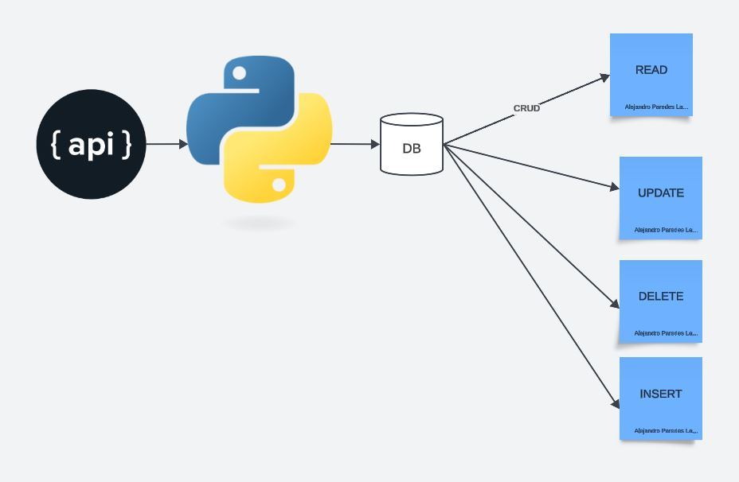

# IDS706_alejandroparedeslatorre_assignment7_SQL

[](https://github.com/nogibjj/IDS706_alejandroparedeslatorre_assignment7_sql_package/actions/workflows/CI.yml)

This repo has an implementation to perform an ETL and a CRUD operation using databricks with two tables:
We extract data from the api:

Star wars people:
https://swapi.dev/api/people/

Star wars planet data
https://swapi.dev/api/planets/

*This library was published in the pypi repository:*
https://test.pypi.org/project/etl-tool-aplt/0.0.2/


We perform basic operations upon the database

* `Create` - insert

* `Read`: We get the average height of the characters of star wars grouped by its planet and ordered by its average height in a descendent order

```bash
SELECT 
avg(pe.height)
, pl.name
FROM aplt_starwars_people pe
inner join aplt_starwars_planets pl on pe.homeworld = pl.url
group by pl.name
ORDER BY avg(pe.height) DESC

```


* `Update`

* `Delete`


According to the requirement we have

* `Makefile`

* `Dockerfile`

* `requirements.txt` with a set of specifications

* `githubactions` 

* `.devcontainer` for Githubcodespace 

## Purpose of project
The purpose of this project is to build a basic CRUD using python inbuilt sqllite libraries and to implement CLI operations.

## The architecture for the project is presented as follows:


## Sample CRUD Operations

python main.py extract-transform-load

python main.py create "101" "otro_v2" "175" "12333" "blonde" "green" "blue" "male" "2"

python main.py read

python main.py update "101" "otro_v2" "175" "12333" "blonde" "green" "blue" "male" "2"

python main.py delete "101"

## Preparation
1. open codespaces 
2. load repo to code spaces
2. Wait for the installation of all the requirements in requirements.txt